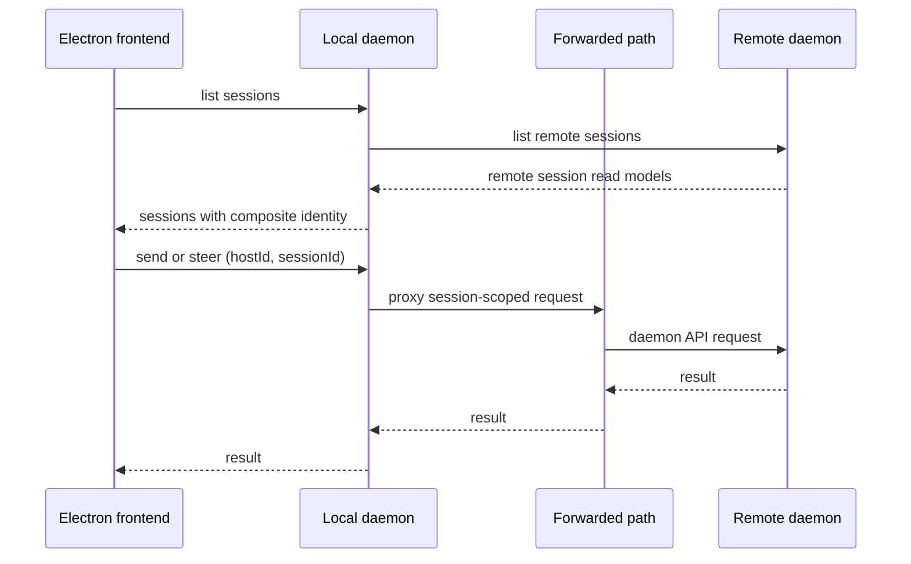
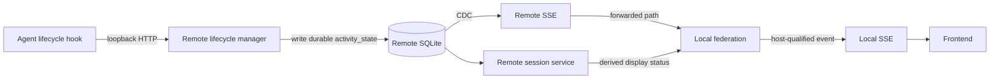

# Federation boundary

## Local daemon is the federation point

Federation belongs in the local daemon behind its existing API. The frontend
continues to address one daemon, while the local daemon lists locally owned and
remotely owned sessions together and proxies a session-scoped request to the
daemon named by the session's host.

This placement preserves the frontend's one-base-url model. Today its query
keys and routes use a bare session id, terminal WebSockets derive from that one
base, and browser previews are indexed by session id alone. Requiring the
frontend to thread host identity through each of those surfaces would make the
host topology a UI concern. It is instead resolved at the daemon API boundary.

A separate gateway process is intentionally excluded. It would add another
deployable component, data directory, run file, and port to coordinate with a
daemon that already owns those operational responsibilities, without adding a
new capability.

## Composite identity

Session ids are assigned as `{project}-{num}` and are unique only within the
daemon that assigned them. A federated session is therefore identified as
`(hostId, sessionId)`, with the local daemon also having a stable local host id.
The pair is the identity used for aggregation, routing, cache invalidation, and
terminal attachment. Bare ids may remain an implementation detail inside an
owning daemon, but must never select a session across the federation.

This prevents a session on one host from shadowing a same-named session on
another host and prevents a terminal stream from being routed to the wrong
machine.

## Reads, writes, and events

Federation is not a read-only board. For a remote session, the local daemon
proxies the same session-scoped operations that it accepts for a local session:

- Session reads and derived display status.
- Prompts, sends, chat steering, input resolution, and interruption.
- Lifecycle operations supported by the owning daemon.
- SSE-backed changes and notification visibility.
- `/mux` terminal attachment, input, resize, and output.

Each remote daemon remains the source of truth for its durable session facts.
The local daemon consumes its session reads and SSE changes, qualifies them by
`hostId`, and publishes a single local event surface for the frontend. While a
local client is connected to that event surface, the local daemon keeps a
subscription to each reachable remote daemon and reconnects a dropped remote
stream with backoff. A remote outage is logged but does not end the local
stream.

The local database does not copy a remote daemon's schema or derive remote
status. It does retain an opaque, last-known session view in
`remote_session_snapshots` after a successful remote list. That small cache
lets the board explain a remote session after a local restart while its owner
is unavailable, instead of silently making the session disappear. Its display
status and `activity_state` are still always the owning daemon's values; the
local daemon never recomputes either from cached or partial facts.

Forwarded event envelopes qualify `sessionId`, and their payloads qualify every
session reference, including nested references such as `session`,
`fromSession`, and `toSession`. Remote event sequence numbers are meaningful
only to their owner, so they are not used as the local daemon's durable SSE
replay cursor.

`activity_state` follows this same path. It is observed and written only by the
owning remote daemon's lifecycle flow, then carried as part of its read model
and events. The local daemon displays the owning daemon's derived display
status; it does not invent a separate remote status reducer.

## Terminal paths

The normal desktop terminal path remains available through the local daemon's
`/mux` endpoint. The mux protocol identifies a pane by its opaque runtime
handle rather than a session id, so a remote session view qualifies its exposed
terminal handle as `hostId~handleId`. The local daemon removes that routing
prefix only while forwarding the existing mux frame to the owning daemon, and
restores it on frames flowing back. Input, output, resize, and close frames
therefore retain the mux protocol unchanged while the frontend stays on one
WebSocket base. A dropped remote mux connection logs its reason, reports a
terminal error, and closes the client socket rather than leaving a dead pane
open.

That relay is not the only terminal path, and it must never become a required
intermediary. **Direct access survives the abstraction: any session, local or
remote, can be opened in a real terminal and talked to without the orchestrator
mediating.** A remote host's normal machine-level terminal access can reach its
local runtime directly; federation must not remove or replace that capability.

The current daemon distinguishes TUI sessions, which run an agent in a terminal
runtime, from Chat sessions, which do not have an agent terminal runtime. The
invariant requires the eventual remote-host API to make the available direct
terminal surface explicit for every session mode rather than implying that all
sessions already expose an agent tmux attachment.
