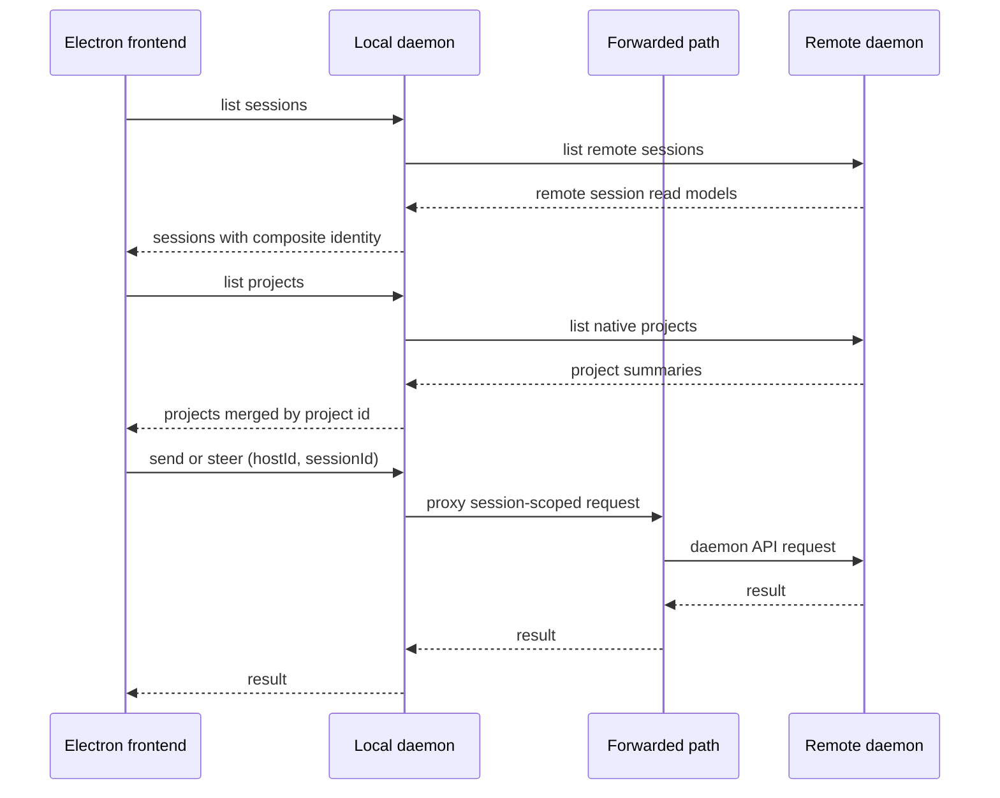
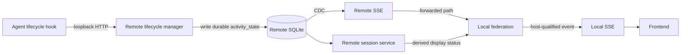

# Federation boundary

## Local daemon is the federation point

Federation belongs in the local daemon behind its existing API. The frontend
continues to address one daemon, while the local daemon lists locally owned and
remotely owned sessions and projects together and proxies a session-scoped
request to the daemon named by the session's host.

This placement preserves the frontend's one-base-url model. Today its query
keys and routes use a bare session id, terminal WebSockets derive from that one
base, and browser previews are indexed by session id alone. Requiring the
frontend to thread host identity through each of those surfaces would make the
host topology a UI concern. It is instead resolved at the daemon API boundary.

A separate gateway process is intentionally excluded. It would add another
deployable component, data directory, run file, and port to coordinate with a
daemon that already owns those operational responsibilities, without adding a
new capability.

## Composite identity

Session ids are assigned as `{project}-{num}` and are unique only within the
daemon that assigned them. A federated session is therefore identified as
`(hostId, sessionId)`, with the local daemon also having a stable local host id.
The pair is the identity used for aggregation, routing, cache invalidation, and
terminal attachment. Bare ids may remain an implementation detail inside an
owning daemon, but must never select a session across the federation.

This prevents a session on one host from shadowing a same-named session on
another host and prevents a terminal stream from being routed to the wrong
machine.

## Project aggregation

`GET /projects` aggregates the local project list with native project lists
from every registered remote host. The project id is the board grouping key:
one local project and any number of remote projects with the same id produce a
single workspace containing all sessions with that `projectId`. This is a
display relationship only. It never qualifies, routes, invalidates, or opens a
session; those operations continue to require the `(hostId, sessionId)`
identity above.

Project ids are intentionally name-like keys rather than globally unique
repository identities. That means two unrelated repositories configured with
the same id on different hosts will share a board workspace. This matches the
operator-facing grouping contract today. A future repository-identity field
could make this stricter, but path cannot: paths are machine-local and differ
between otherwise identical checkouts.

When summaries for one id disagree, the local summary wins when present;
otherwise the remote host with the lexicographically smallest host id wins.
The response also carries every source and a list of conflicting metadata
fields (name, path, kind, and orchestrator setting), so the selected summary
does not hide a potentially misleading difference. Sessions remain visibly
grouped by their owning host inside the merged workspace.

## Proxy contract

The proxy is a deliberately narrow translation boundary between the local API
and an owning daemon. It forwards a session-bearing operation only after
resolving the qualified identity to its registered host, removes the host
qualification only for that owner-side request, and restores qualification in
the response presented to the local client.

Only a small allowlist of request headers crosses this boundary. Credentials,
cookies, and origin or control headers are never forwarded. This is an
allowlist rather than a denylist because a denylist fails open as soon as a
new, security-relevant header is not on it.

Every client used to reach a remote daemon refuses redirects outright,
including bounded, streaming, and terminal connections. Remote addresses are
normally forwarded loopback ports; a redirect could otherwise turn a request
toward the local daemon's own services. A remote daemon is therefore not
allowed to choose a second destination on the local daemon's behalf.

Identity qualification happens at the response boundary, not just while
assembling session lists. Every returned session reference is qualified,
including nested references and terminal handles, before a client can reuse
it. This keeps a follow-up action attached to the owning machine even when a
response contains a session relationship rather than a top-level session.

## Creation targets

Creation has no session id yet, so it cannot use ordinary qualified-id routing.
`POST /sessions` and the desktop task flow's `POST /orchestrators/delegate`
accept an optional explicit `targetHostId`. When it is absent, the local daemon
creates work exactly as it always has. When it names a registered remote host,
the local daemon checks that host's current availability, removes
`targetHostId` from the owner-side body, and forwards the same creation request
to that daemon.

The response is qualified at the federation boundary before returning to the
client. A created remote session (and its terminal handle, or a delegated
worker/orchestrator id) is therefore immediately usable through the existing
session proxy and cannot collide with a same-named local session. The target is
explicit because a merged project workspace can contain sources from multiple
machines; a workspace id alone must never silently choose one.

An unavailable, stopped, or destroyed target fails before any owner-side
request, naming the host and its recorded reason. Creation never falls back to
local in that case.

A remote session's preview URL is omitted. Its un-rewritten port would resolve
on the operator's machine, not on the owning machine, and a link to the wrong
machine is worse than no link. A routed preview surface is required before
remote previews can be exposed.

Routing is based on session-bearing operations, rather than treating the
uniform `/sessions/{sessionId}/` shape as universal. Most operations use that
shape, but some session-bearing operations do not. Treating the prefix as a
complete routing rule would silently resolve a qualified id locally.

## Reads, writes, and events

Federation is not a read-only board. For a remote session, the local daemon
proxies the same session-scoped operations that it accepts for a local session:

- Session reads and derived display status.
- Prompts, sends, chat steering, input resolution, and interruption.
- Lifecycle operations supported by the owning daemon.
- SSE-backed changes and notification visibility.
- `/mux` terminal attachment, input, resize, and output.

Each remote daemon remains the source of truth for its durable session facts.
The local daemon consumes its session reads and SSE changes, qualifies them by
`hostId`, and publishes a single local event surface for the frontend. While a
local client is connected to that event surface, the local daemon keeps a
subscription to each reachable remote daemon and reconnects a dropped remote
stream with backoff. A remote outage is logged but does not end the local
stream.

The first subscription to a remote event stream begins at its current tail,
then reconnects after the last remote sequence that was forwarded. This avoids
replaying a remote daemon's entire history to every new local subscriber. That
old behavior could fill the shared buffer, cancel the local stream, reconnect,
and replay again: a livelock that became worse the longer a host had been in
use. If a remote buffer is full, the local daemon backpressures that remote
socket instead of cancelling the local stream.

The local database does not copy a remote daemon's schema or derive remote
status. It does retain an opaque, last-known session view in
`remote_session_snapshots` after each successful owner-driven health refresh,
including the initial successful probe during registration. That small cache
lets the board explain a remote session after a local restart while its owner
is unavailable, instead of silently making the session disappear. Its display
status and `activity_state` are still always the owning daemon's values; the
local daemon never recomputes either from cached or partial facts.

Registered hosts are returned alongside the existing board-project response,
so the desktop sidebar can show every connected host even when it owns zero
sessions. This does not change project grouping: hosts are an operator-facing
inventory and destination picker, while projects remain merged by project id.
With no registered hosts, the response adds no host data and the frontend makes
no extra request or renders an empty host affordance.

## Host inventory

Host registration establishes that a daemon has joined the federation. It does
not establish the operator's machine inventory: a stopped machine cannot
register, and a machine manager is the authority on whether that machine
exists and whether it is running. The optional host inventory provider supplies
that second fact. Reachability remains exclusively the local daemon's probe
result, so an inventory record never makes a host available by itself.

The provider is enabled only by `AO_HOST_INVENTORY_COMMAND`, a JSON argv array.
For example, `AO_HOST_INVENTORY_COMMAND='["inventory-command","list","--json"]'`
runs `inventory-command` directly with `list` and `--json` as arguments. It is
never passed to a shell. `AO_HOST_INVENTORY_INTERVAL`,
`AO_HOST_INVENTORY_TIMEOUT`, and `AO_HOST_INVENTORY_MAX_OUTPUT` bound refresh
frequency, one command execution, and stdout bytes; their defaults are 30s,
10s, and 1048576 bytes. Without the command, the daemon retains the registered
host behavior, performs no inventory command or inventory-specific board work,
and never removes a registration from inventory evidence.

Each successful command writes one JSON value: an array of objects with `id`,
`label`, and `lifecycle`, plus optional `address`. `id` is the existing
lowercase host slug; `label` is a non-empty display label of at most 120
characters; `lifecycle` is either `running` or `stopped`; and `address`, when
present, is the remote daemon `host:port`. Unknown fields, duplicate ids,
malformed JSON, oversized output, a timeout, and a non-zero command exit are
failed refreshes.

An inventory `running` host is probed by the daemon. A successful probe displays
it as `available`; a failed probe displays it as `unreachable` with the probe's
reason. An inventory `stopped` host is displayed as `stopped` and is not
probed. The provider does not supply `available` or `unreachable`, because
those states would duplicate and potentially contradict the daemon's single
reachability observation.

Inventory and registration merge by host id. A matching pair produces one host
row. A non-empty registered label wins over the inventory label, matching the
project merge rule that the directly owned source wins when present; the
inventory label is the fallback. A provider address wins when it is present,
otherwise the registered address is used. The provider lifecycle remains the
lifecycle authority for its records.

A registration that is absent from two consecutive successful inventory reads
is removed, together with its cached session snapshots, so a deleted machine
leaves the board. The first absence leaves the registration visible; requiring
a second successful read prevents one intermittent partial provider response
from deleting a live registration. The daemon removes the registration rather
than marking it `destroyed`: `destroyed` remains an operator-selected state for
a known host, while inventory-confirmed absence means that no host row remains.
An inventory read that fails or is stale never advances this confirmation and
resets an in-progress absence count. The daemon retains the last successful
inventory and marks it stale instead, because a failed command cannot prove
that every omitted machine is gone.

The daemon retains the last successful inventory in memory when a refresh
fails. It marks those rows `inventoryStale` with `inventoryError`, and the
board response also carries `remoteHostInventoryStale` and
`remoteHostInventoryError` so a failure after an empty successful inventory is
still visible. A command failure is therefore never rendered as an empty,
apparently complete inventory. A later successful empty array means exactly
that the provider reports no machines.

If a host cannot return its project list, federation derives the minimum
project rows needed from `projectId` values in those session snapshots. Those
fallback rows retain each cached session's workspace and carry the host's
unavailability reason; they do not claim current project metadata.

Forwarded event envelopes qualify `sessionId`, and their payloads qualify every
session reference, including nested references such as `session`,
`fromSession`, and `toSession`. Remote event sequence numbers are meaningful
only to their owner, so they are not used as the local daemon's durable SSE
replay cursor.

`activity_state` follows this same path. It is observed and written only by the
owning remote daemon's lifecycle flow, then carried as part of its read model
and events. The local daemon displays the owning daemon's derived display
status; it does not invent a separate remote status reducer.

## Notification federation

Notification lists combine the local list with every registered remote owner's
list concurrently. Each remote read has its own timeout, so an unavailable
host cannot delay usable notification results from the others.

A host whose notification list cannot be read is returned as an explicit
remote failure with that host's reason; it is never folded into a calm,
apparently complete bell. An empty bell can mean either that nothing needs the
operator or that the host could not be asked. Only the first is safe to
believe, which is why partial failure is part of the list contract.

Notification ids are host-qualified, as are the embedded session references in
their targets. A notification action therefore resolves to its owner, and
opening a notification cannot surface a same-named session on another machine.
Notification mutations use the existing session proxy's host resolution and
forwarding path rather than creating a second remote mutation path.

Notification streaming is intentionally live-only. Unlike session events, it
has no durable cursor: fan-in subscribes at the remote tail and reconnects
safely, but cannot replay notifications missed while disconnected. Refreshing
the aggregated notification list is the recovery mechanism for that gap; the
stream must not be mistaken for a complete history.

## Terminal paths

The normal desktop terminal path remains available through the local daemon's
`/mux` endpoint. The mux protocol identifies a pane by its opaque runtime
handle rather than a session id, so a remote session view qualifies its exposed
terminal handle as `hostId~handleId`. The local daemon removes that routing
prefix only while forwarding the existing mux frame to the owning daemon, and
restores it on frames flowing back. Input, output, resize, and close frames
therefore retain the mux protocol unchanged while the frontend stays on one
WebSocket base. A dropped remote mux connection logs its reason, reports a
terminal error, and closes the client socket rather than leaving a dead pane
open.

That relay is not the only terminal path, and it must never become a required
intermediary. **Direct access survives the abstraction: any session, local or
remote, can be opened in a real terminal and talked to without the orchestrator
mediating.** A remote host's normal machine-level terminal access can reach its
local runtime directly; federation must not remove or replace that capability.

The current daemon distinguishes TUI sessions, which run an agent in a terminal
runtime, from Chat sessions, which do not have an agent terminal runtime. The
invariant requires the eventual remote-host API to make the available direct
terminal surface explicit for every session mode rather than implying that all
sessions already expose an agent tmux attachment.
