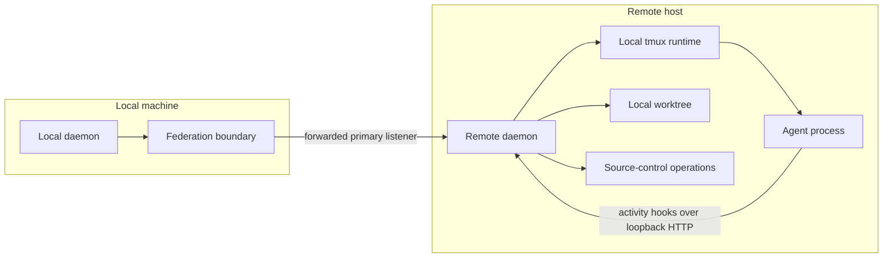

# Remote-host model

## A remote host owns its daemon

A remote host is another machine running an ordinary, complete Agent
Orchestrator daemon. It owns its own SQLite state, lifecycle manager,
observation loops, runtime adapter, workspace adapter, source-control adapter,
and agent processes. It must be able to operate correctly when viewed on its
own, without the local daemon.

This is deliberately not a remote runtime feature. The daemon assumes that a
runtime, its workspace, and source-control operations are co-located. Moving
only the runtime off-machine would turn each of those assumptions into a
cross-machine adapter problem. A self-contained daemon preserves the existing
ports/adapters boundary and lets each daemon retain the normal lifecycle and
storage model.

## Container placement

When agents on the remote machine run in a container, the daemon runs inside
that same container. The daemon, agent, worktree, and source-control tooling
therefore share one filesystem, process environment, user identity, and
loopback network namespace.

This removes the container boundary instead of bridging it. No execution hop,
user-id translation, or socket relay is required. In particular, no container
runtime adapter belongs in this design: the existing local tmux runtime is used
unchanged. The container image must provide tmux and the selected agent
binaries.

Hook-based activity detection also remains unchanged. Agent lifecycle hooks
call the daemon through loopback HTTP in the same place as the agent and its
daemon, so the lifecycle manager records the normal `activity_state` facts.

## Reachability is external

The daemon's remote-host contract is intentionally narrow: a configured
`hostId` and an address reachable from the local daemon, normally a local
forwarded port. Creating and maintaining that reachability is outside the
daemon. An operator may use a secure forwarding mechanism or other provisioning
tooling, but neither mechanism is modeled, started, authenticated, or repaired
by the daemon.

The forwarded target is the remote daemon's primary loopback listener, normally
`127.0.0.1:3001`. Port 3001 is the current default; an installation that changes
the daemon port must make its forwarding configuration agree. That listener
already serves the required REST API, SSE streams, and `/mux` terminal
WebSocket.

The separate LAN listener is not part of remote-host reachability. The reason
is its `0.0.0.0` bind address, which conflicts with the invariant that a remote
machine exposes no inbound network surface. This is not a judgement about that
listener's request authentication: its bearer credential is checked per
request. The forwarding layer supplies the reachability and transport
encryption required here while the daemon stays loopback-bound.

## Boundaries

| Boundary | Owns | Does not own |
| --- | --- | --- |
| Remote daemon | Sessions, durable facts, derived display status, runtimes, worktrees, and observations for its machine | Local aggregation or tunnel setup |
| Forwarding layer | Encrypted path from the local daemon to a remote loopback listener | Session semantics or daemon state |
| Local daemon | Host registry, session and project aggregation, composite session identity, and proxying its public API | Remote runtime, workspace, or source-control operations |
| Frontend | One daemon API base, host inventory and destination selection, and its normal views | Host connectivity, federation routing, or a second API base |

Project aggregation uses project id as an intentional board-only grouping key.
Matching ids from local and remote daemons are one workspace; it does not turn
project ids into routable cross-host identities. Session ids remain qualified
by host for every operation. Paths are retained as source metadata rather than
used to match projects because equivalent repositories normally have different
machine-local paths.

The app shows every registered host in its sidebar inventory, including a host
with no sessions, with its availability state and recorded failure reason. The
new-task flow presents Local as the default destination and lists remote hosts
as explicit alternatives. It does not infer a destination from the currently
selected project because a merged workspace can span multiple hosts.
