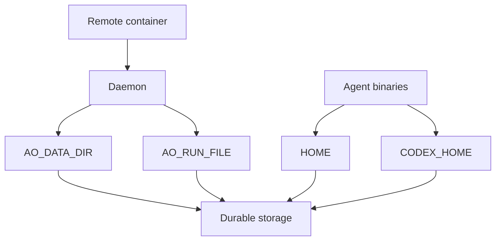

# Remote-host operation and failure model

## Durable placement

A container recreation destroys paths that are not mounted on durable storage.
For a daemon in a container, the operator must explicitly place its state on
durable storage rather than relying on process defaults.

The daemon reads `$AO_DATA_DIR/config.yaml` (default `~/.ao/data/config.yaml`)
before applying environment variables, so environment values override file
values. `AO_DATA_DIR` remains an environment bootstrap setting because it
locates that file. A missing file is harmless; a malformed or group/world-writable
file rejects startup. The host-inventory and listener fields are documented in
the [CLI configuration schema](../cli/README.md#configuration).

The current daemon configuration also uses these environment variables:

| Variable | Role | Remote-host requirement |
| --- | --- | --- |
| `AO_DATA_DIR` | Durable daemon data directory; default `~/.ao/data` | Set it to a durable mounted path. It protects the board, session database, worktrees, prompts, and other daemon-managed state. |
| `AO_RUN_FILE` | Daemon run-file path; default `~/.ao/running.json` | Set it to a durable mounted path compatible with the daemon data placement. |
| `AO_REMOTE_HOST_PROBE_TIMEOUT` | Per-host health probe and session snapshot timeout; default `10s` | Set a positive Go duration when the forwarding path needs more or less time. |
| `HOME` | Default home used by the daemon and agent tooling | Make it durable when agent or tool configuration belongs there. |
| `CODEX_HOME` | Location consulted for Codex-managed state | Make it durable when that harness is in use. |

The variable names above are the names currently recognized by the code. The
defaults under `~/.ao` are safe only when that home directory itself is durable.
Persisting only the source checkout is insufficient: recovery also needs the
daemon's database, worktree records, and session prompt state.

The container image also carries tmux and the selected agent binaries. Those
are execution prerequisites, not a replacement for persistent state.

## Host availability is visible state

A remote host can become unreachable. Its sessions must remain represented on
the local board with an explanation rather than disappearing from the list.
Host reachability is an observation about the forwarding path and remote daemon,
not a durable session fact asserted by the remote daemon while it is absent.

| Host state | Meaning | Board behavior |
| --- | --- | --- |
| Available | The local daemon can reach the remote daemon and obtain current data. | Show current remote read models and permit supported operations. |
| Unreachable | The host was registered but cannot currently be reached. | Retain its sessions, mark them gone or unavailable with the reachability explanation, and prevent operations that require the owner. Project rows needed by cached sessions are retained from their snapshot `projectId` values, so those sessions still have a workspace on the board. |
| Stopped | The remote host is intentionally or temporarily offline while its durable storage survives. | Show the recoverable stopped state. On return, reconnect, refresh the read models, and restore normal operations. |
| Destroyed | The remote host and its durable state are final. | Show a final destroyed state; it is not expected to restore. |

The host inventory is visible even when a host has no sessions. Unavailable,
stopped, and destroyed hosts remain visible with their recorded reason but are
not available in the new-task destination picker. A request aimed directly at
one of those hosts fails before forwarding and never creates a local session.

The local daemon must retain enough host-registration and last-known session
metadata to distinguish `stopped` from `destroyed` and to explain why a session
cannot presently be operated. It must not silently turn an unreachable host into
a deleted session, nor infer that its runtime is dead from a failed reachability
probe.

## Probe scheduling is bounded

Health probes run concurrently through a bounded worker pool, with a timeout
per host. `AO_REMOTE_HOST_PROBE_TIMEOUT` accepts a positive Go duration and
defaults to `10s`. The default is nearly four times a measured `2.67s`
forwarded health response, leaving practical connection-establishment margin
without allowing a blackholed host to hold a worker indefinitely. A successful
probe also refreshes that host's complete opaque session snapshot before the
timeout expires, including the immediate probe performed when a host is
registered. This adds one native session-list request per reachable host per
probe interval; it is not driven by board clients. A blackholed or slow host
must not delay another host's successful recovery or snapshot refresh from
becoming visible, while the bound prevents a large registry from creating
unlimited probe work.

The first probe uses the same bound as steady-state probes. A larger default
already covers normal cold forwarded connections, and one uniform per-host
limit keeps registration and recurring scheduling predictable. A timeout is
reported as `remote host did not respond before the timeout`; a refusal
is reported as `remote daemon is not listening (connection refused)`.

The probe worker is demand-driven: it does not start until the first remote
host is registered and stops after the last is removed. The zero-remote-hosts
path performs no background probe work or registry reads.

## Recovery and operator boundary

When a stopped host returns, its own daemon reconciles its runtimes and durable
facts under the existing lifecycle rules. The local daemon then reconnects,
re-subscribes to SSE, replaces stale aggregated read models, and resumes proxy
routing. It never reconstructs remote worktrees or session state locally.

The operator owns the remote machine lifecycle, durable mounts, agent
credentials and configuration, and the secure forwarding path. The daemon owns
only the contract to an already reachable daemon address and the resulting
federation behavior.
